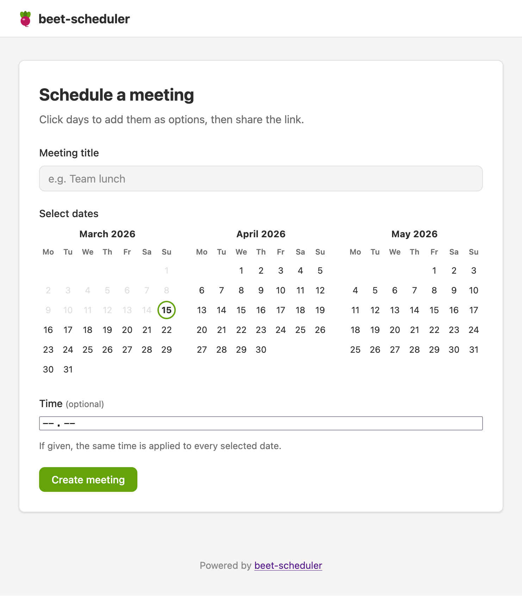

<!--
SPDX-FileCopyrightText: 2026 Miikka Koskinen

SPDX-License-Identifier: MIT
-->

# beet-scheduler

Vibecoded site for scheduling polls.



## Running it locally

```bash
just run
```

## Configuration

Configuration is loaded from `beet-scheduler.toml` (optional) and environment variables prefixed with `BEET_`.

| Key | Env var | Default | Description |
|-----|---------|---------|-------------|
| `html_snippet` | `BEET_HTML_SNIPPET` | _(empty)_ | Raw HTML injected into every page, e.g. an analytics script. |

Example `beet-scheduler.toml`:

```toml
html_snippet = '<script defer src="https://example.com/analytics.js"></script>'
```
